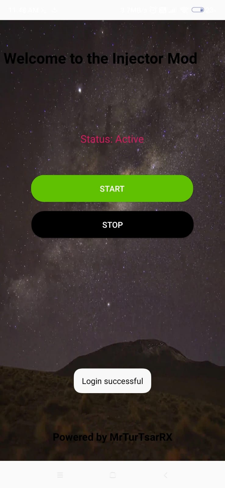
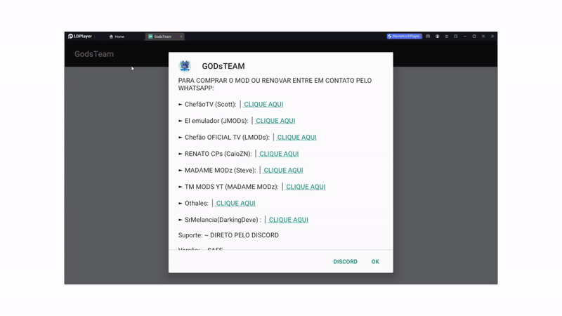

# User Login System

This repository showcases a user login system implemented using Java, C++, and PHP. The application validates user credentials to ensure the entered username and password are correct. A floating menu feature, controlled by C++ logic, is also included. The floating menu becomes accessible only after a successful login.

# Login PHP Script

This repository contains the `login.php` script in the `phpFile` directory. It handles the login functionality for user authentication using PHP.
phpFile/ └── login.php
[Click here to visit Login.php](https://github.com/MrTusarRX/Gods-Team-Login-Layout/tree/main/phpFile)
## Directory Structure

#[Download Src](https://github.com/MrTusarRX/Gods-Team-LoginInjectorLgl/releases)

# Lgl Floating HexPatches

**Lgl Floating HexPatches** is a powerful tool that allows you to modify a game’s functionality by injecting Hex values into the game’s library (lib). It enables real-time game modifications, providing a floating menu for user interaction and easy access to various patching options.

## Features

- **Hex Injection**: Inject custom Hex values into the game’s library (lib) to modify its functions, features, and behavior.
- **Floating Menu**: A user-friendly floating menu that gives you quick access to options for Hex injections, configuration settings, and additional functionalities.
- **Game Modding**: Enables modification of in-game data such as values, variables, or functions, making it ideal for customizing or modifying game behavior.
- **Real-Time Updates**: Changes take effect immediately after injecting Hex values, offering dynamic game modding.
- **Require**: A root device
## Directory Structure
---

## Features

1. **User Login Validation**:
   - Ensures secure and accurate username and password verification.
   - Implements logic using Java, C++, and PHP for cross-platform efficiency.

2. **Floating Menu Logic**:
   - Controlled using C++ for efficient logic handling.
   - Accessible only after a successful login.
   - Prevents unauthorized access to menu options.

3. **Cross-Language Workflow**:
   - **Java**: Handles the front-end logic and Android APK layout.
   - **C++**: Manages high-performance validation tasks and floating menu logic.
   - **PHP**: Connects to the server for backend processing.

---

## APK Layout

Below are screenshots of the APK's layout:

### Login Screen


### Success Message


### Floating Menu (Accessible After Login)


*Note: Replace `path/to/` with the actual paths to your screenshots in the repository.*

---

## How It Works

### Login Process
1. The user enters their **username** and **password** on the login screen.
2. The application sends the credentials to the server.
3. The C++ module verifies the credentials by interacting with a secure database.
4. The server responds:
   - **Correct credentials**: A success message is displayed, and the user is logged in.
   - **Incorrect credentials**: An error message prompts the user to re-enter the details.

### Floating Menu Logic
1. After a successful login, the floating menu is enabled.
2. The C++ logic ensures the menu remains inaccessible unless the user is logged in.
3. The floating menu allows users to perform additional actions based on their access level.

---

## Getting Started

### Prerequisites
- Android Studio for running the APK.
- A backend server configured with PHP and a database for credential verification.
- C++ compiler for handling validation and floating menu logic.

### Installation
1. Clone the repository:
   ```bash
   git clone https://github.com/MrTusarRX/Gods-Team-Login-Layout.git
